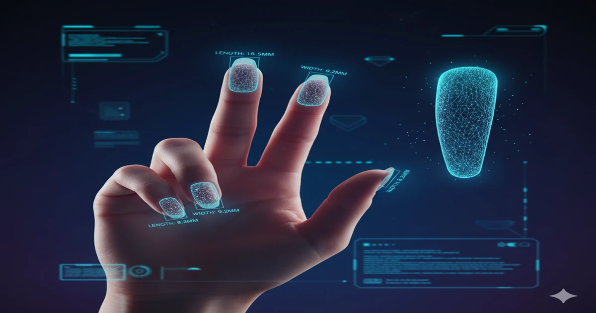
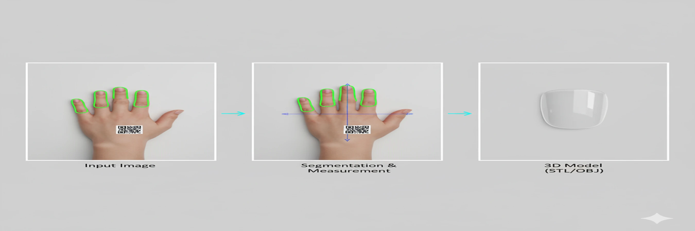
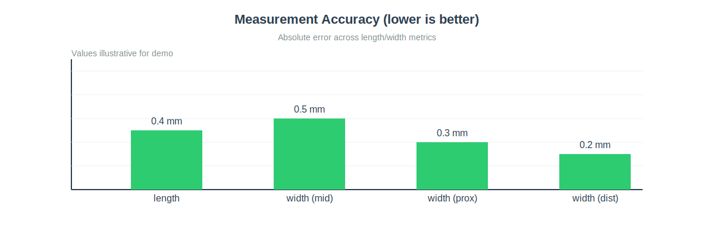
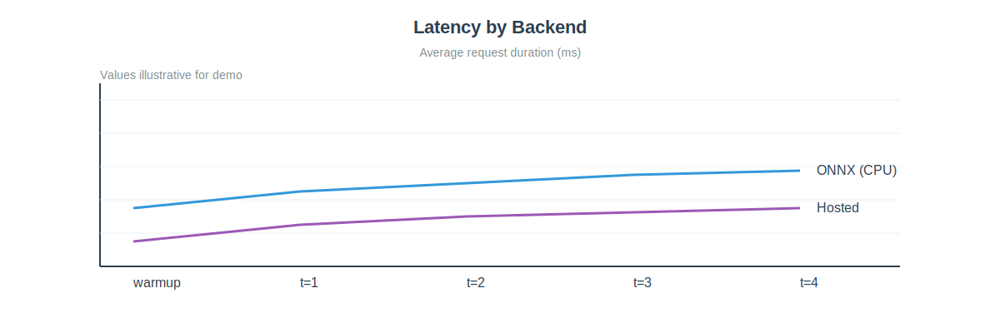
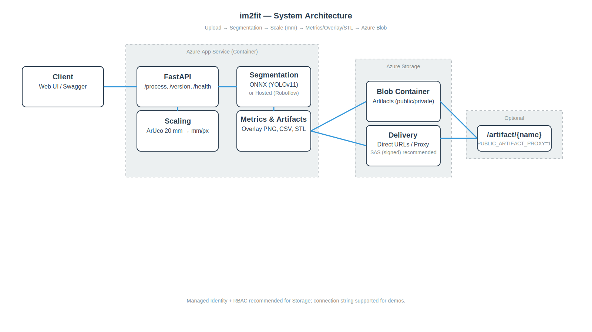
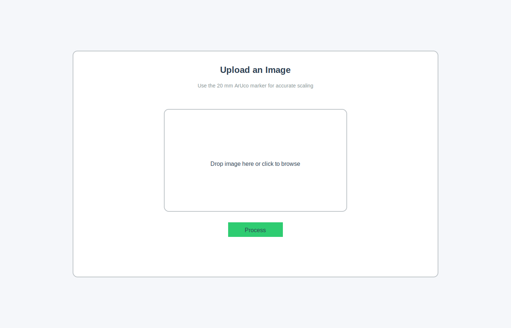
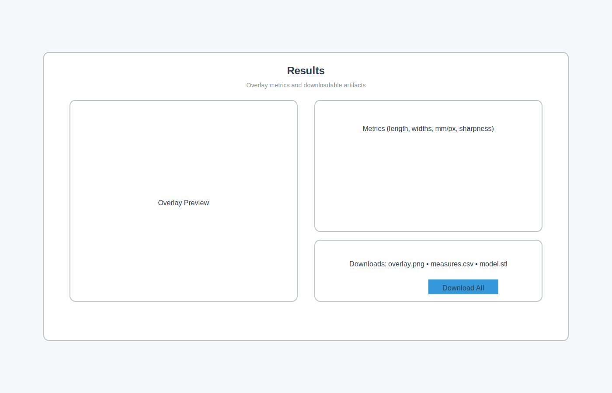

# im2fit — Modular 2D→3D Customization Pipeline

Welcome to the im2fit project. This repository contains a modular and scalable computer-vision and 3D modeling pipeline that transforms a simple 2D image into a custom-fit 3D model. While the demo implementation targets beauty-tech (custom nail models), the core architecture generalizes to many custom product manufacturing and design scenarios.

## Business Value & Use Cases

This project demonstrates an end-to-end solution for translating real-world, physical dimensions into digital, customizable products.

- Precision & Customization: Automates sizing with accurate computer vision and real-world scaling, enabling a perfect fit per customer.
- Scalability: Processes high volumes at low cost by leveraging CPU-friendly ONNX inference and cloud storage.
- Efficiency: Fully automated from image → metrics → STL, reducing design time and accelerating fulfillment.
- Better UX: Supports interactive previews and returns downloadable artifacts (overlay, CSV, STL) within a single API call.

Broader applications:

- Manufacturing: Inline measurement and shape extraction for QA and defect detection.
- Medical Devices: Custom prosthetics/orthotics based on patient imagery.
- Dental: Designing crowns or aligners from intraoral images.
- Footwear: Personalized insoles via mobile imagery.

## Technical Stack & Capabilities

| Component        | Description                                                                               |
| ---------------- | ----------------------------------------------------------------------------------------- |
| Web Framework    | FastAPI (Python) served via Gunicorn + Uvicorn for high-throughput async I/O              |
| Image Processing | OpenCV + NumPy with ArUco marker detection for real-world scaling                         |
| Segmentation     | YOLOv11 exported to ONNX; CPU-friendly `onnxruntime` inference; swappable hosted backend  |
| Geometry         | Shapely for robust planar geometry; Trimesh for watertight STL export                     |
| Cloud            | Azure App Service (container) and Azure Blob Storage for durable artifacts                |
| DevOps           | Docker, Azure Bicep (`infra/`), and `azure.yaml` for reproducible provisioning/deployment |

## Architecture Overview

- Inference pipeline (`app/pipeline.py`): orchestrates segmentation (hosted or ONNX), mm scaling, measurements, overlay, STL generation.
- API (`app/main.py`): `/process` accepts an image, invokes pipeline, uploads artifacts to Azure Blob, returns public URLs + metrics.
- Backends: toggle via env (`USE_ONNX=1` for local ONNX; otherwise Roboflow Hosted with `ROBOFLOW_*`).
- Scaling: `scale_aruco.py` computes `mm_per_px` from a 20 mm ArUco marker (DICT_4X4_50); falls back to `0.25 mm/px` with low confidence.
- 3D Modeling: `to_3d.py` converts outline → prism + crown and exports STL.

## API

- POST `/process`
  - Request: multipart form with one `image/*` file (≤ 5 MB)
  - Response (200):
    ```json
    {
      "overlay_url": "https://.../123_overlay.png",
      "csv_url": "https://.../123_measures.csv",
      "stl_url": "https://.../123_nail.stl",
      "backend": "onnx" | "hosted",
      "scale_confidence": 0.0,
      "metrics": {
        "length_mm": 28.3,
        "width_mid_mm": 14.9,
        "mm_per_px": 0.25,
        "sharpness": 123.4,
        "axis_origin": [x, y],
        "axis_vec": [vx, vy]
      }
    }
    ```
- GET `/version`: includes a short ONNX model SHA-256 when present.
- GET `/health`: health probe used by container healthcheck.
- GET `/`: simple index page; client-side viewer lives in `app/static/js/`.

## How It Works

1. Upload image (with a 20 mm ArUco marker).
2. Segment target region (YOLOv11-SEG ONNX or Roboflow Hosted).
3. Compute `mm_per_px` from ArUco; fallback if not detected.
4. Derive metrics via PCA along the principal axis (length, widths, area, sharpness).
5. Render overlay PNG and build STL from densified outline.
6. Upload artifacts to Azure Blob; return public URLs.

## Local Development

Windows PowerShell (example):

```powershell
# Optional: Kaggle cache dir for dataset scripts
setx KAGGLE_CONFIG_DIR ".kaggle"

# Install dependencies
make setup

# Run API (dev)
uvicorn app.main:app --reload --port 8000

# Exercise the pipeline against an image
python demo_local.py path\to\image.png
```

- Env vars for backends:
  - Hosted: set `ROBOFLOW_API_KEY`, `ROBOFLOW_INFER_URL`
  - ONNX: set `USE_ONNX=1`, `ONNX_MODEL_PATH` (default `model/best.onnx`)
- Required for artifact uploads: `AZURE_STORAGE_CONNECTION_STRING` (or use a dummy value for local-only testing, but uploads will fail).

## Testing

```powershell
pytest -q
```

- Tests monkeypatch heavy/external dependencies (`onnx_infer.infer_mask`, `scale_aruco.mm_per_pixel_from_aruco`).
- `pytest.ini` sets `pythonpath=app`.

## Deployment (Azure)

- Infra: `azure.yaml` and `infra/main.bicep` provision ACR, Storage, App Service, and Application Insights.
- App settings: `BLOB_CONTAINER` (default `im2fit-outputs`), `AZURE_STORAGE_CONNECTION_STRING`, and backend vars.
- Demo-focused defaults: `APP_ENV=demo`.
- The container exposes port `8000`; healthcheck hits `/health`.

## Project Positioning

This repository demonstrates:

- End-to-end pipeline implementation: upload → metrics → artifacts (PNG, CSV, STL).
- Production-grade patterns: modular pipeline, deterministic unit tests, infra as code, containerized runtime.
- Practical expertise: Computer vision (OpenCV), segmentation (YOLO→ONNX), and 3D modeling (Shapely/Trimesh).

## Visual Overview (Product-style)

<!-- Hero -->



<p align="center" class="muted">From a single photo to a millimeter-accurate 3D model.</p>

<!-- Triptych -->



<p align="center" class="muted">Left: input image; Middle: measured overlay; Right: generated STL.</p>

<!-- KPI row -->
<p align="center">
  
  
</p>

<!-- Architecture -->



<p align="center" class="muted">FastAPI orchestrates segmentation and scaling; artifacts are stored in Azure Blob.</p>

<!-- UI -->
<p align="center">
  
  
</p>

> Download the 20 mm ArUco marker: [PNG](app/static/markers/aruco_20mm.png) (print at 100% scale)

## Commit Message Guidelines

Use Conventional Commits to keep history clear and scannable:

- `feat:` new feature (e.g., `feat: Implement interactive web UI with 3D model viewer`)
- `fix:` bug fix
- `docs:` documentation or examples
- `refactor:` code change that neither fixes a bug nor adds a feature
- `test:` add or improve tests
- `build/chore:` tooling, CI, dependencies

Suggested replacements for recent history:

- `feat: Initialize core pipeline with FastAPI and Azure integrations`
- `build: Establish foundational project structure and dependencies`
- `feat: Implement interactive web UI with 3D model viewer`
- `docs: Add script for local pipeline demonstration`
- `docs: Refine documentation and configuration for public release`

To amend the last commit message:

```powershell
git commit --amend -m "docs: Refine documentation and configuration for public release"
```

To interactively update multiple past messages (advanced):

```powershell
git rebase -i HEAD~5
# Change 'pick' to 'reword' on the commits you want to edit, save and follow prompts
```

Note: Force-pushing rewritten history will affect collaborators and CI. Coordinate before running `git push --force-with-lease`.

## Security & Privacy

- Data scope: The API accepts a single image and returns derived artifacts (PNG/CSV/STL). No PII is stored by design.
- Storage: Artifacts are uploaded to Azure Blob Storage. For production, consider private containers plus a signed URL strategy. The demo can use public URLs for ease of testing.
- Secrets: Configure `AZURE_STORAGE_CONNECTION_STRING`, `ROBOFLOW_API_KEY` via Azure App Service Configuration or GitHub Actions secrets. Do not commit secrets.
- Access control: App Service is internet-exposed by default. For restricted environments, place behind Front Door / WAF or use IP restrictions.
- Observability: Application Insights is provisioned via Bicep; enable sampling and log retention policies per org standards.

## Roadmap

- GPU/Accelerated Inference: Optional CUDA/TensorRT container variant; model auto-discovery via environment.
- Model Management: Versioned ONNX models, registry-backed download at startup, and `/models` version endpoint.
- Storage Access: Managed identity + RBAC for blob access instead of connection strings.
- Signed URLs: Replace direct blob URLs with time-limited SAS links; optional `/artifact/{name}` proxy.
- Frontend Viewer: Expand client viewer to preview STL, overlay metrics, and allow basic QA annotations.
- CI/CD: GitHub Actions with build cache layers, SAST/secret scanning, and environment gates.
